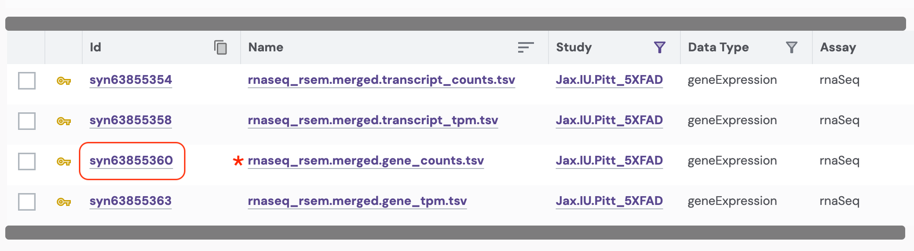
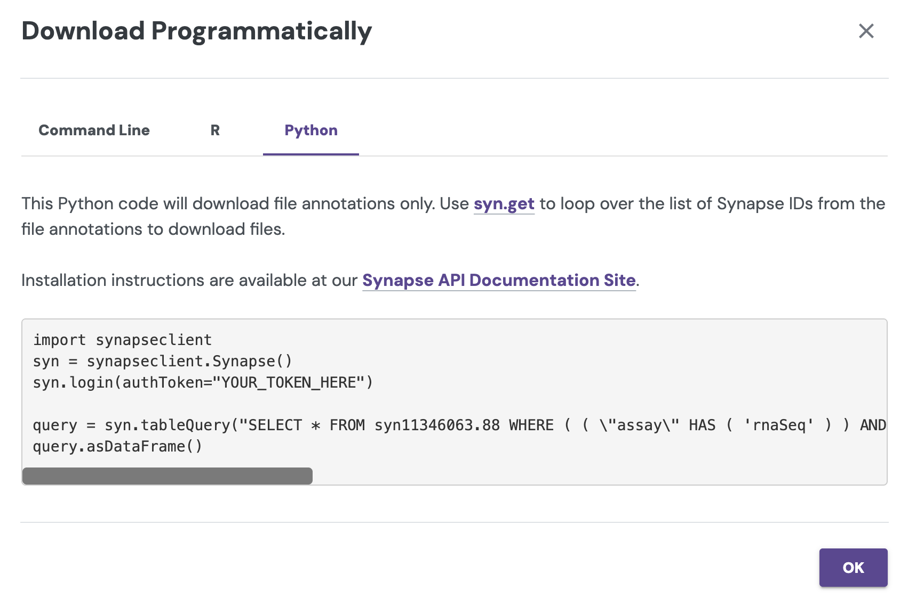

```{r, set-opts, include=FALSE}
knitr::opts_chunk$set(
  eval = TRUE,
  print.rows = 10
)

# Prevent individual IDs from printing out in scientific notation
options(scipen = 999)
```

------------------------------------------------------------------------

## Overview

We will be working with metadata and RNAseq counts data from The Jax.IU.Pitt_5XFAD Study (Jax.IU.Pitt_5XFAD), which can be found [here on the AD Knowledge Portal](https://adknowledgeportal.synapse.org/Explore/Studies/DetailsPage/StudyData?Study=syn66318332). During this workshop we will use R to:

1. Log in to Synapse

2. Download the counts file (single-file download from Synapse)

3. Download the metadata files (bulk data download from Synapse)

4. Map samples in data files to information in metadata files

5. Explore the data

------------------------------------------------------------------------

## Setup

### Install and load packages

#### reticulate and tidyverse

You will need `reticulate` and the `tidyverse` family of packages. The "tidyverse" package is shorthand for installing a bunch of packages we need for this notebook (dplyr, ggplot2, purrr, readr, stringr, tibble). It also installs "forcats" and "tidyr", which are not used in this notebook.

**✏ Note:** This notebook requires `reticulate` version 1.41 or later. If you already have an older version of `reticulate` installed, running the code below will update it.

```{r install-r-packages, eval = FALSE}
install.packages(c("reticulate", "tidyverse"))
```


#### synapseclient

We will use `synapseclient` (the [Synapse python client](https://python-docs.synapse.org/) package) from R via `reticulate`. You don't need to have Python installed: the `py_require()` function from `reticulate` will automatically download Python and `synapseclient` into a Python environment that `reticulate` manages for you. The first time you run this, it may take a minute or two. After that, the environment is cached and loads quickly.

**✏ Note:** A [Synapse R client](https://r-docs.synapse.org/articles/synapser.html) also exists, but is in the process of being updated to accommodate recent changes to `synapseclient`. Therefore we will be using `synapseclient` in R with `reticulate` for this workshop rather than the native R client.

#### Load libraries and set up Python

`py_require()` must be called *before* importing any Python packages. If you get an error that Python has already been initialized, restart your R session (*Session > Restart R* in RStudio) and run this code again.

```{r load-libraries, message=FALSE, warning=FALSE}
library(reticulate)
library(dplyr)
library(purrr)
library(readr)
library(stringr)
library(tibble)
library(ggplot2)

# Tell reticulate to use the Python environment it manages, even if you have
# other Python installations or environments on your computer
Sys.setenv(RETICULATE_USE_MANAGED_VENV = "yes")

# Install Python and synapseclient, if needed, and activate the environment
py_require("synapseclient")

# python import
syncli <- import("synapseclient")
```

### Login to Synapse

Next, you will need to log in to your Synapse account.

#### Login option 1: Synapseclient takes credentials from your Synapse web session

If you are logged into the [Synapse](https://www.synapse.org/) web browser, `synapseclient` will automatically use your login credentials to log you in during your R session! All you have to do is call `syn$login()` from a script or the R console.

```{r synlogin_run}
#| output: false
syn = syncli$Synapse()
syn$login()
```

#### Login option 2: Synapse PAT

If you have never used `synapseclient` (or `synapser`) before, follow these instructions to [generate a personal access token](https://docs.synapse.org/synapse-docs/managing-your-account#Logging-in-programmatically), then paste the PAT into the code below. Make sure you scope your access token to allow you to View, Download, and Modify.

**⚠ DO NOT put your Synapse access token in scripts that will be shared with others, or they will be able to log in as you.**

```{r eval=FALSE}
syn$login(authToken = "<paste your personal access token here>")
```

For more information on managing Synapse credentials with `synapseclient`, see the documentation [here](https://python-docs.synapse.org/en/stable/tutorials/authentication/).

------------------------------------------------------------------------

## Download data

While you can always download data from the AD Portal website via your web browser, it's usually faster and often more convenient to download data programmatically.

### Download a single file

To download a single file from the AD Knowledge Portal, copy its Synapse ID from the search results in the portal or go directly to the file's page in Synapse to find its ID. Then use the `syn$get()` function from `synapseclient` to download the file.

#### Exercise 1: Use [Explore Data](https://adknowledgeportal.synapse.org/Explore/Data) to find processed RNAseq data from the Jax.IU.Pitt_5XFAD Study

This exercise filters the table to four files. We will download `rnaseq_rsem.merged.gene_counts.tsv'. The Synapse ID for this file is in the "Id" column.

{width="800"}

We can then use that synID to download the file. Some information about the file and its storage location within Synapse is assigned to the variable `counts_file`.

```{r single-synGet, results = "hide"}
counts_id <- "syn63855360"
counts_file <- syn$get(counts_id,
                       downloadLocation = "files/",
                       ifcollision = "overwrite.local")
```

The `if_collision="overwrite.local"` argument overwrites any local copies with the same name/path on your computer, avoiding multiple copies piling up. The client checks the local file against the Synapse version and downloads it only when needed.

This is very useful for large files especially: you can ensure that you always have the latest copy of a file from Synapse, without having to re-download the file if you already have the current version on your hard drive.

The variable `counts_file` is a Synapse `File` entity object. Its attributes include `.path`, `.annotations`, and `.version_number`, which contain information about where the file is in Synapse, how it is labeled, what version it is, etc.

Synapse ID of the file:
```{r}
counts_file$id
```

The local path where the file was download:
```{r}
counts_file$path
```

The file version:
```{r}
counts_file$versionNumber
```

Let's take a quick look at the file we just downloaded.

```{r print-counts}
counts <- read_tsv(counts_file$path, show_col_types = FALSE)
head(select(counts, -`transcript_id(s)`)) # Removing a wide column for display purposes
```

### Bulk download files {#bulk-download-files}

#### Exercise 2: Use [Explore Data](https://adknowledgeportal.synapse.org/Explore/Data) to find all metadata files from the Jax.IU.Pitt_5XFAD study

Use the facets and search bar to look for data you want to download from the AD Knowledge Portal. Once you've identified the files you want, click on the download arrow icon on the top right of the Explore Data table and select "Programmatic Options" from the drop-down menu.

{width="300"}

In the window that pops up, select the "Python" tab from the top menu bar (or the "R" tab, if you use `synapser`). This will display some Python/R code that constructs a SQL query of the Synapse data table that drives the AD Knowledge Portal. This query will allow us to download only the files that meet our search criteria.

{width="400"}

**We'll download our files using two steps:**

1.  We will use the `syn$tableQuery()` code the portal gave us to download a CSV file that lists all of the files we want. This CSV file is a table, one row per file in the list, containing the Synapse ID, file name, annotations, etc associated with each file.

    a.  This does NOT download the files themselves. It only fetches a list of the files plus their annotations for you.

2.  We will call `syn$get()` on each Synapse ID in the table to download the files.

**Why isn't this just one step instead of two?**

Splitting this into steps can be extremely helpful for cases where you might not want to download all of the files back-to-back. For example, if the file sizes are very large or if you are downloading hundreds of files. Downloading the table first lets you: a) Fetch helpful annotations about the files without downloading them first, and b) do things like loop through the list one by one, download a file, do some processing, and delete the file before downloading the next one to save hard drive space.

**Back to downloading...**

The function `syn$tableQuery()` returns a Synapse object wrapper around the CSV file, which is automatically downloaded to a folder called `.synapseCache` in your home directory. You can use `query$filepath` to see the path to the file in the Synapse cache.

```{r portal-query}
# download the results of the filtered table query
query_string <- paste(
  "SELECT * FROM syn11346063 WHERE (( `study` HAS ( 'Jax.IU.Pitt_5XFAD' ))",
  "AND ( `resourceType` = 'metadata' ) )"
)

results <- syn$tableQuery(query_string, includeRowIdAndRowVersion = FALSE)

# view the file path of the resulting csv
results$filepath
```

We'll use `read_csv` (from the `readr` package) to read the CSV file into R (although the provided `read.table` or any other base R version is also fine!). We can explore the `download_table` object and see that it contains information on all of the AD Portal data files we want to download. Some columns like the "id" and "parentId" columns contain info about where the file is in Synapse, and some columns contain AD Portal annotations for each file, like "dataType", "specimenID", and "assay". This annotation table will later allow us to link downloaded files to additional metadata variables!

```{r read-query-table}
# read in the table query csv file
download_table <- read_csv(results$filepath, show_col_types = FALSE)

download_table
```

Let's look at a subset of columns that might be useful:

```{r view_download_table}
download_table |>
  dplyr::select(id, name, metadataType, assay, fileFormat, currentVersion)
```

**Tip:** Rename and save this file somewhere memorable to have a complete record of all the files you are using and what version of each file was downloaded – for reproducibility!

*Note: `|>` is the base R pipe operator. If you are unfamiliar with the pipe, think of it as a shorthand for "take this (the preceding object) and do that (the subsequent command)". See [here](https://r4ds.hadley.nz/data-transform.html#sec-the-pipe) for more info on piping in R.*

Finally, we use a mapping function from the `purrr` package to loop through the "id" column and apply the `syn$get()` function to each file's synID. In this case, we use `purrr::walk()` because it lets us call `syn$get()` for its side effect (downloading files to a location we specify), and returns nothing.

```{r bulk-download-purrr, results="hide"}
# loop through the column of synIDs and download each file
purrr::walk(download_table$id, ~syn$get(.x, downloadLocation = "files/",
                                        ifcollision = "overwrite.local"))
```

You can also do this as a `for` loop, i.e.:

```{r bulk-download-for-loop, eval=FALSE}
for (syn_id in download_table$id) {
  syn$get(syn_id,
          downloadLocation = "files/",
          ifcollision = "overwrite.local")
}
```

Congratulations, you have bulk downloaded files from the AD Knowledge Portal!

##### ✏ Note on file versions

All files in the AD Portal are versioned, meaning that if the file represented by a particular synID changes, a new version will be created. To download a specific version, set the `version` argument in `syn$get()`. More info on version control in the AD Portal and the Synapse platform can be found [here](https://docs.synapse.org/synapse-docs/versioning-files).

### Single-specimen files

For files that contain data from a single specimen (e.g. raw sequencing files, raw mass spectra, etc.), we can use the Synapse annotations to associate these files with the appropriate metadata.

#### Excercise 3: Use [Explore Data](https://adknowledgeportal.synapse.org/Explore/Data) to find *all* RNAseq files from the Jax.IU.Pitt_5XFAD study.

If we filter for data where Study = "Jax.IU.Pitt_5XFAD" and Assay = "rnaSeq" we will get a list of 149 files, including raw fastqs and processed counts data.

#### Synapse entity annotations

We can use the function `syn$get_annotations` to view the annotations associated with any file *before* actually downloading the file.

```{r json-single-file-annotations}
# the synID of a random fastq file from this list
fastq_id <- "syn22108503"

# this is a python dict
fastq_annotations <- syn$get_annotations(fastq_id)

names(fastq_annotations)

# Access values by key like you would a named list
print(paste("individualID:", fastq_annotations$individualID))
print(paste("specimenID:", fastq_annotations$specimenID))
```

The file annotations let us see which study the file is associated with (Jax.IU.Pitt.5XFAD), which species it's from (Mouse), which assay generated the file (rnaSeq), and a whole bunch of other properties. Most importantly, single-specimen files are annotated with with the specimenID of the specimen in the file, and the individualID of the individual that specimen was taken from. We can use these annotations to link files to the rest of the metadata, including metadata that is not in annotations. This is especially helpful for human studies, as potentially identifying information like age, race, and diagnosis is not included in file annotations.

```{r join-annotations-to-metadata}
ind_meta <- read_csv("files/individual_animal_metadata_Jax.IU.Pitt_5XFAD.csv",
                     show_col_types = FALSE)

# find records belonging to the individual this file maps to in our joined metadata
filter(ind_meta, individualID == fastq_annotations$individualID)
```

#### Annotations during bulk download

When bulk downloading many files, the best practice is to preserve the download manifest that is generated which lists all the files, their synIDs, and all their annotations.

If we use the "Programmatic Options" tab in the AD Portal download menu to download all 149 rnaSeq files from the 5XFAD study, we would get a table query that looks like this:

```{r all-rnaseq-portal-query}
query_str <- paste(
  "SELECT * FROM syn11346063 WHERE ( ( \"study\" HAS ( 'Jax.IU.Pitt_5XFAD' ) )",
  "AND ( \"assay\" HAS ( 'rnaSeq' ) ) )"
)
results <- syn$tableQuery(query_str, includeRowIdAndRowVersion = FALSE)
```

As we saw previously, this downloads a csv file with the results of our AD Portal query. Opening that file lets us see which specimens are associated with which files:

```{r read-annotations-table, warning = FALSE, message = FALSE}
annotations_table <- read_csv(results$filepath, show_col_types = FALSE)

head(annotations_table)
```

You could then use `purrr::walk(download_table$id, ~syn$get(.x, downloadLocation = <your-download-directory>))` to walk through the column of synIDs and download all 149 files.

### Multispecimen files

Multispecimen files in the AD Knowledge Portal are files that contain data or information from more than one specimen. They are not annotated with individualIDs or specimenIDs, since these files may contain numbers of specimens that exceed the annotation limits. These files are usually processed or summary data (gene counts, peptide quantifications, etc), and are always annotated with `isMultiSpecimen = TRUE`.

If we look at the processed data files in the table of 5XFAD RNAseq file annotations we just downloaded, we will see that `isMultiSpecimen = TRUE`, but individualID and specimenID are blank:

```{r filter-multispecimen-files}
annotations_table |>
  filter(fileFormat == "tsv") |>
  dplyr::select(name, individualID, specimenID, isMultiSpecimen)
```

The multispecimen file should contain a row or column of specimenIDs that correspond to the specimenIDs used in a study's metadata. **Note:** this study uses `individualIDs` instead, which is unusual. Most studies use `specimenID` for column names in data like this.

```{r counts-specimen-ids, message=FALSE, warning=FALSE}
colnames(counts)[1:20]
```

------------------------------------------------------------------------

## Working with AD Portal metadata

### Metadata basics

We have now downloaded several metadata files and an RNAseq counts file from the portal. For our next exercises, we want to read those files in as R data so we can work with them.

We can see from the `download_table` we got during the bulk download step that we have six metadata files. Two of these should be the individual and biospecimen files, and four of them are assay metadata files.

```{r explore-download-table}
download_table |> 
  dplyr::select(name, metadataType, assay)
```

We are only interested in RNAseq data, so we will only read in the individual, biospecimen, and RNAseq assay metadata files.

Now we can read all the metadata files in to R as data frames. Here we have to force `readr` to treat the individualID column as a string, because individualIDs in this study are strings of numbers.

```{r read-metadata-files}
# individual metadata
ind_meta <- read_csv("files/individual_animal_metadata_Jax.IU.Pitt_5XFAD.csv",
                     col_types = list(individualID = col_character()),
                     show_col_types = FALSE)

# biospecimen metadata
bio_meta <- read_csv("files/biospecimen_metadata_Jax.IU.Pitt_5XFAD.csv",
                     col_types = list(individualID = col_character()),
                     show_col_types = FALSE)

# assay metadata
rna_meta <- read_csv("files/assay_RNAseq_Jax.IU.Pitt_5XFAD.csv",
                     show_col_types = FALSE)
```

##### ✏ Note on best practices

We've been using the `ifcollision = "overwrite.local"` argument to `syn$get()` to avoid making multiple copies of each file, so hard-coding the file names in the code block above works as expected. However, if you forget this argument or the file gets renamed on Synapse, you could be reading in an old file instead of the one you just downloaded!

It's good practice to use the `$path` variable from the output of `syn$get()` instead of hard-coding the file name, to avoid accidentally reading the wrong file. Here is some code to find the correct metadata files (not executed in this notebook), using the annotations we downloaded already.

```{r download-best-practices, eval=FALSE}
ind_file_id <- subset(download_table, metadataType == "individual")$id
bio_file_id <- subset(download_table, metadataType == "biospecimen")$id
assay_file_id <- subset(download_table, metadataType == "assay metadata" &
                       grepl("rnaSeq", assay))$id

ind_file <- syn$get(ind_file_id)
ind_meta <- read_csv(ind_file$path,
                     col_types = list(individualID = col_character()),
                     show_col_types = FALSE)
# ... etc with the biospecimen and assay metadata
```

### Verify file contents

At this point we have downloaded and read in the counts file and 3 metadata files into the variables `counts`, `ind_meta`, `bio_meta`, and `rna_meta`.

Let's examine the data and metadata files a bit before we begin our analyses.

#### Counts data

```{r view-counts}
head(select(counts, -`transcript_id(s)`))
```

The counts data file has a column of Ensembl gene IDs, a column of transcript IDs (not shown above), and the rest of the columns are count data, where the column headers correspond to the individualID of the sample.

Remember, typically for studies these column headers would be specimenIDs instead, which should all match what is in the RNAseq assay metadata file.

```{r view-assay}
head(rna_meta)
```

Are all the column headers from the counts matrix (except the first two columns) in the assay metadata?

```{r check-specIDs-data}
all(colnames(counts)[c(-1, -2)] %in% rna_meta$specimenID)
```

No, because these are individualIDs, which are in the individual metadata file:
```{r}
all(colnames(counts)[c(-1, -2)] %in% ind_meta$individualID)
```

#### Assay metadata

The assay metadata contains information about how data was generated on each sample in the assay. Each specimenID represents a unique sample.

How many unique specimens were sequenced?

```{r}
n_distinct(rna_meta$specimenID)
```

Were the samples all sequenced on the same platform and in the same batch?

```{r}
distinct(rna_meta, platform, sequencingBatch)
```

#### Biospecimen metadata

The biospecimen metadata contains specimen-level information, including organ and tissue the specimen was taken from, how it was prepared, etc. Each specimenID is mapped to an individualID.

```{r view-biospecimen}
head(bio_meta)
```

All specimens from the RNAseq assay metadata file should be in the biospecimen file...

```{r check-biospecimen}
all(rna_meta$specimenID %in% bio_meta$specimenID)
```

...But the biospecimen file also contains specimens from different assays.

```{r}
all(bio_meta$specimenID %in% rna_meta$specimenID)
```

```{r}
unique(bio_meta$assay)
```


#### Individual metadata

The individual metadata contains information about all the individuals in the study, represented by unique individualIDs. For humans, this includes information on age, sex, race, diagnosis, etc. For MODEL-AD mouse models, the individual metadata has information on model genotypes, stock numbers, diet, and more.

```{r view-individual-metadata}
head(ind_meta)
```

All individualIDs in the biospecimen file should be in the individual file.

```{r check-individual}
all(bio_meta$individualID %in% ind_meta$individualID)
```

Which model genotypes are in this study?

```{r}
distinct(ind_meta, genotype)
```

### Joining metadata

We use the three-file structure for our metadata because it allows us to store metadata for each study in a tidy format. Every line in the assay and biospecimen files represents a unique specimen, and every line in the individual file represents a unique individual. This means the files can be easily joined by specimenID and individualID to get all levels of metadata that apply to a particular data file. We will use the `left_join()` function from the `dplyr` package, and the base R pipe operator `|>`.

```{r join-metadata}
# join all the rows in the assay metadata that have a match in the biospecimen metadata
joined_meta <- rna_meta |> #start with the rnaseq assay metadata
  
  #join rows from biospecimen that match specimenID
  left_join(bio_meta, by = "specimenID") |>
  
  # join rows from individual that match individualID
  left_join(ind_meta, by = "individualID")

head(joined_meta)
```

We now have a very wide dataframe that contains all the available metadata on each specimen in the RNAseq data from this study. This procedure can be used to join the three types of metadata files for every study in the AD Knowledge Portal, allowing you to filter individuals and specimens as needed based on your analysis criteria!

------------------------------------------------------------------------

## RNASeq data exploration

We will use the counts data and metadata to do some basic exploratory analysis of gene expression in the Jax 5XFAD mouse model.

### Explore covariates

Which covariates from the metadata are we interested in?

```{r distinct-meta-covars}
# all samples are from the same organ and tissue, so we can probably discard
# these variables
distinct(joined_meta, organ, tissue)

# we have different sexes and genotypes, so we are probably interested in those
distinct(joined_meta, sex, genotype)

# there are different ages, so we are probably interested in age
joined_meta$ageDeath |> unique() |> sort()
```

For this example, we will plot gene expression by sex, genotype, and age.

#### Create age group column

This study has three main age groups, but the ages of the mice are non-integer values. Here we bin the ages into groups.

```{r, add-age-group-column, warning = FALSE, message = FALSE}
joined_meta <- joined_meta |>
  # convert numeric ages to age_group categories --
  # <= 5: 4 mo, > 5 and <= 10: 6 mo, > 10: 12 mo
  mutate(age_group = cut(ageDeath,
                         breaks = c(0, 5, 10, Inf),
                         labels = c("4 mo", "6 mo", "12 mo")))
```

We now have balanced samples across sex, genotype, and age:

```{r group-metadata-by-covars}
joined_meta |>
  group_by(sex, genotype, age_group) |>
  dplyr::count()
```

#### Subset covariates

To reduce the width of the dataframe, we will subset only the columns that contain covariates we're interested in exploring further. Retaining the individualID and specimenID columns will make sure we can map the covariates to the data and back to the original metadata if needed!

```{r subset-covars}
# many packages have a "select" function that masks dplyr so we have to specify
covars <- joined_meta |>
  dplyr::select(individualID, specimenID, sex, genotype, age_group)

# check the result
head(covars)
```

### Convert ensemblIDs to common gene names

Return to the gene counts matrix we read in earlier. 5XFAD mice express human APP and PSEN1, and the counts matrix includes these human genes (recognizable as starting with `ENSG` instead of `ENSMUS`):

```{r check-non-mouse-genes}
counts |> 
  filter(str_detect(gene_id, "ENSG")) |>
  select(-`transcript_id(s)`)
```

For display, we want to map all Ensembl IDs to their gene symbols. There are several R libraries that will let you query for this information, but for this workshop we will use a pre-made mapping file.

```{r read-preconverted-ensembl-counts}
ensembl_to_gene <- read.csv(file = "ensembl_translation_key.csv")
named_counts <- counts |>
  dplyr::left_join(ensembl_to_gene, by = "gene_id") |>
  relocate(gene_name, .after = gene_id)

head(named_counts)
```

How many genes are missing a gene symbol?

```{r check-na-genes}
sum(is.na(named_counts$gene_name) | nchar(named_counts$gene_name) == 0)
```

Are all the gene names unique?

```{r check-unique-genes}
non_na_genes <- named_counts$gene_name[!is.na(named_counts$gene_name) &
                                         nchar(named_counts$gene_name) > 0]
length(non_na_genes) - n_distinct(non_na_genes)
```

We need to append unique identifiers to the duplicate names so we can transpose the matrix.

```{r clean-gene-names}
# Make all gene names unique and remove unneeded column
named_counts <- named_counts |>
  
  # Replace NA symbols, make all symbols unique
  mutate(gene_name = replace(gene_name, is.na(gene_name), "UNKNOWN"),
         gene_name = replace(gene_name, gene_name == "", "UNKNOWN"),
         gene_name = make.unique(gene_name)) |>
  
  # Throw away Ensembl IDs and transcript IDs
  dplyr::select(-gene_id, -`transcript_id(s)`) |>
  
  # Set rownames to gene_name, also removes the gene_name column
  column_to_rownames(var = "gene_name")

head(named_counts)
```

#### Transpose counts matrix and join to covariates

First, we need to transpose the counts dataframe so that each row contains count data cross all genes for an individual, and join our covariates by ID.

**Note:** most studies in the ADKP use the `specimenID` to label columns in their data files. This study used `individualID` values instead, so we are joining on individualID.

```{r transpose-counts, warning=FALSE}
counts_tposed <- named_counts |>
  t() |>  # transposing also forces the df to a matrix
  as_tibble(rownames = "individualID") |> # reconvert to tibble and specify rownames
  left_join(covars, by = "individualID") # join covariates by ID

  # For most studies this would join on specimenID instead:
  #as_tibble(rownames = "specimenID") |>
  #left_join(covars, by = "specimenID")
```

```{r check-transposed-counts}
# check the transposed matrix looks ok
head(counts_tposed)
```

Let's check that the covariates got included at the end by cutting out most of the genes:

```{r check-transposed-counts-metadata, warning=FALSE}
counts_tposed |>
  dplyr::select(1:3, any_of(colnames(covars))) |>
  head()
```

### Visualize gene count data

Create simple box plots showing counts by genotype and age group, faceted by sex. `age_group` needs to be set as a categorical variable in a sensible order for display.

```{r refactor-age-group}
counts_tposed$age_group <- factor(counts_tposed$age_group,
                                  levels = c("4 mo", "6 mo", "12 mo"))
```

Use ggplot to plot gene counts for each specimen by age, sex, and genotype.

```{r plot-APP}
# Look at APP levels -- this model is the 5X FAD mutant, so we expect it to be high!
g <- counts_tposed |>
  ggplot(aes(x = age_group, y = APP, color = genotype)) +
    geom_boxplot() +
    geom_point(position = position_jitterdodge()) +
    facet_wrap( ~ sex) +
    theme_bw() +
    scale_color_manual(values = c("tomato3", "dodgerblue3"))

g
```

Examine any gene of interest by setting the y argument in the `ggplot(aes()` mapping equal to the gene name. Ex: `y = Trem2`

```{r plot-Trem2}
g <- counts_tposed |>
  ggplot(aes(x = age_group, y = Trem2, color = genotype)) +
    geom_boxplot() +
    geom_point(position = position_jitterdodge()) +
    facet_wrap( ~ sex) +
    theme_bw() +
    scale_color_manual(values = c("tomato3", "dodgerblue3"))

g
```

Ex: `y = Apoe`

```{r plot-Apoe}
g <- counts_tposed |>
  ggplot(aes(x = age_group, y = Apoe, color = genotype)) +
    geom_boxplot() +
    geom_point(position = position_jitterdodge()) +
    facet_wrap( ~ sex) +
    theme_bw() +
    scale_color_manual(values = c("tomato3", "dodgerblue3"))

g
```

------------------------------------------------------------------------

{width="236"}

<details>

<summary>R Package Info</summary>

```{r session-info}
sessionInfo()
```

</details>
